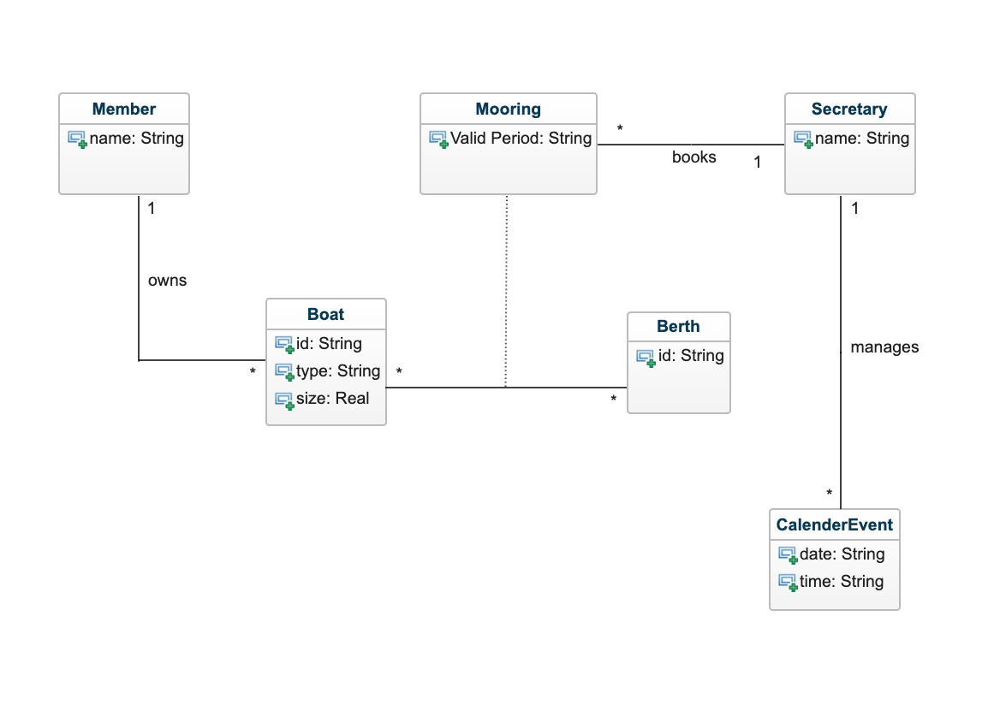

# Domain Model Grade 2
Members: Fabian Dacic(fd222fr), Yuyao Duan(yd222br), and Fredric Eriksson Sepúlveda(fe222pa)   
Program: Software Technology   
Course: 1DV607  
Date of submission: 2021-09-24 

## Domain model discription 
This is the domain model of “The jolly pirate” yacht club in terms of grade 2 requirements. In this model, we come up with six conceptual classes to cover grade 2 tasks. As we can see, the members own the boats, but the association we proposed here is 1..* since each member can own many boats. This association also covers the requirements including register, remove, and change boats. After tutoring session, we created an association class between Boat and Berth which is used for describing mooring records. In this case, we will inform the vaild period of different mooring records. The secretary can book mooring spaces for the boats and manage different calender events.