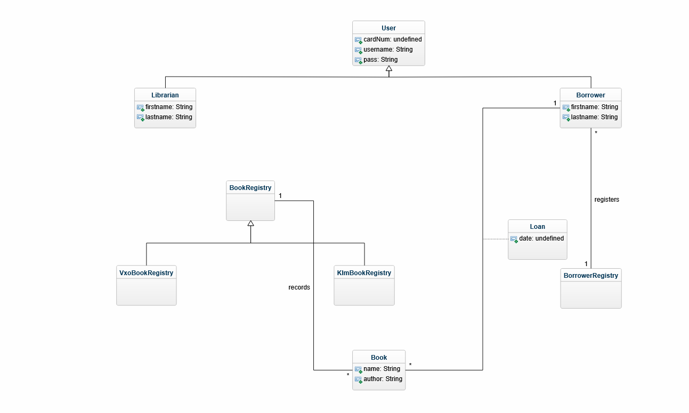

# Domain Model Grade 4
Members: Fabian Dacic(fd222fr), Yuyao Duan(yd222br), and Fredric Eriksson Sepúlveda(fe222pa)   
Program: Software Technology   
Course: 1DV607  
Date of submission: 2021-10-28

## Domain model description
The domain model we decided to investigate in real life is the Linnaeus university's (LNU) library.
We initially started off with a few user cases so in other words analyzed the process that we go through
whenever loaning a new book or any other form of medias available in the library itself. Due to the sake of
simplicity, we have focused on loaning books only hence the domain model is formatted after that.
Our investigation began by interviewing the library's staff and unfortunately there were not many that understood 
domain modelling hence that is one of the many points that this domain modelling needs further improvement.

The person we interviewed was named Kristina, and with her consent we are allowed to present her name, we have
not asked for further information. When she inspected the domain model, or more rightfully said what we thought the 
domain model would look like for the library, she approved of it and pointed out an interesting aspect of it. There is 
the main system of the library, and then there are essentially two copy branches of it. By that is meant that the two 
branches in question are the libraries in Växjö and in Kalmar and the only difference between them is that they have a 
slightly different book registry from each other however share those books between them. We presented that by using 
generalization in the conceptual class "BookRegistry". 

Another aspect in which this domain model could be improved is due to the fact that the library also offers different 
forms of media (movies, games and even a reference section however loaning is not allowed there), a bit more complexity
could be added to the domain model to include those as well although the main focus for our domain model was book loaning.
