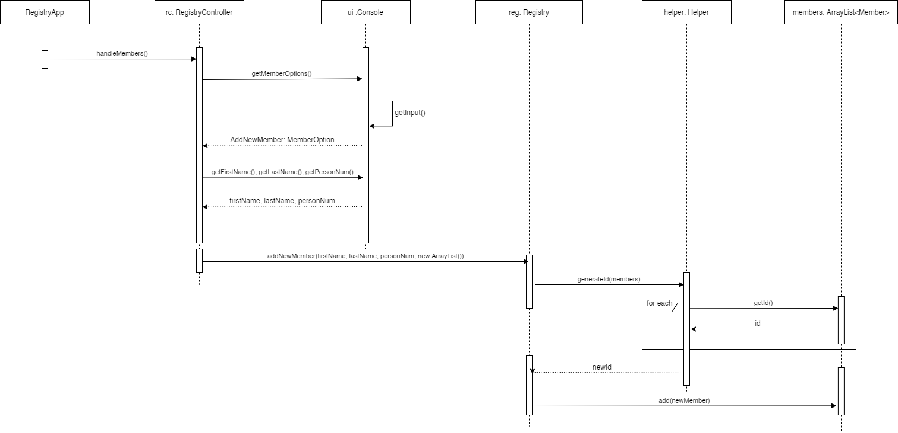

# Boatclub OO-Design

This document describes the design according to the requirements presented in assignment 2.

## Architectural Overview

The application uses the model-view-controller (MVC) architectural pattern. The view is passive and gets called from the
controller. The view may only read information from the model, not directly change it. In grade 4, we added a search package
within view package and removed the hardcoded RepeatPersistence class which was used for initializing data. Two persistence implementations
are added and complex search strategy has been completed.
.png)

## Detailed Design

### Class Diagram
Based on the understanding of the model-view-controller (MVC) architectural design, the class diagram of this application
is presented as following. In the upper left corner of the diagram is model-related classes. In the upper right corner 
of the diagram is view-related classes. In the bottom, RegistryController class is the controller in this design. RegistryApp
includes the main method which is the entrance of this application. Based on the understanding of this course, we want to 
highlight two interface classes in our design, MemberBoatUi and Persistence. We use MemberBoatUi class to define what data the 
UI can present which will standardize other UI implementations later. The Persistence class will be used for achieving data persistence
in the later development. As we can see, in this grade 4 design, the Console class has a dependency on MemberSearch interface 
which is realized by four different search strategies. AndOnlySearchBracket and OrOnlySearchBracket are used for achieving complex
search.
.png)

### Sequence Diagram

The generating of IDs is done by the Helper through the inspection of all current existing member IDs, and a returning
of the next available ID starting from 1.