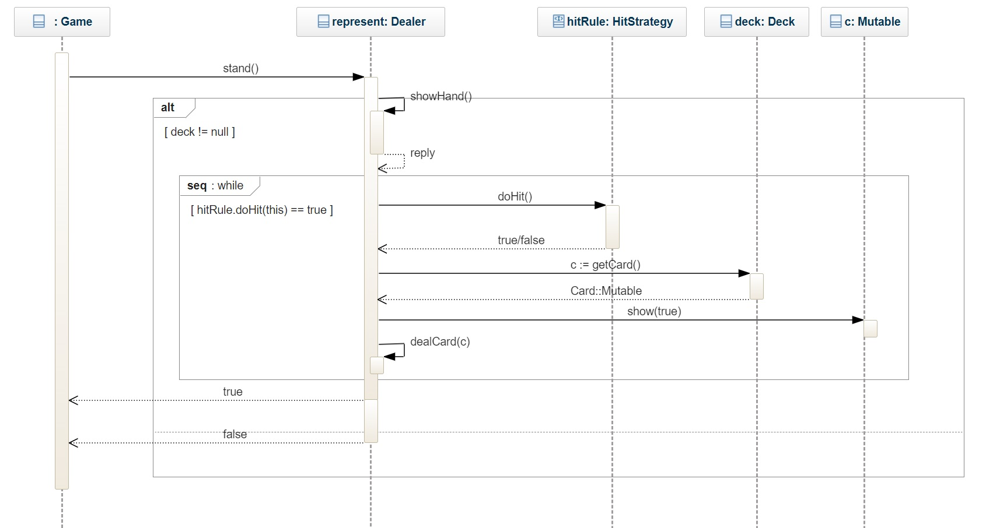

# BlackJack OO-Design
This document describes the current design. Note that some dependencies have been left out for readability reasons. For example there are a lot of dependencies to the Card class.

## Class Diagram
The application uses the model-view-controller (MVC) architectural pattern. The view has been implemented with Observer Pattern, Abstract Factory, Visitor Pattern. Furthermore, the
duplicated codes are removed from EnglishView and SwedishView by creating a new GeneralView which holds all common parts of both views.

.png)

## Stand - Sequence Diagram
This is the detailed sequence diagram for the `Game.stand` method. This is what should be implemented.

